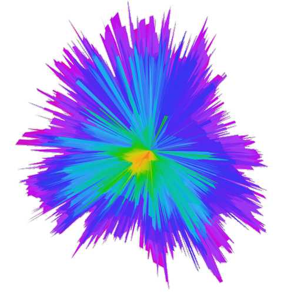

# range1090

Generate and visualise a detailed polar diagram for the range of your ADS-B receiver.

An interactive demo is available at https://zivillian.github.io/range1090/

## How it works

range1090 connects to you running dump1090 via the SBS protocol and receives all altitude and position messages. For each flight level (every 100ft) the maximum distance is recorded.

In regular intervals a GeoJSON is saved. This contains one feature per flight level (500 in total) with the outline of the maximum distance.

The [html](html) folder contains a sample sample web page for viewing and filtering the polar chart.
